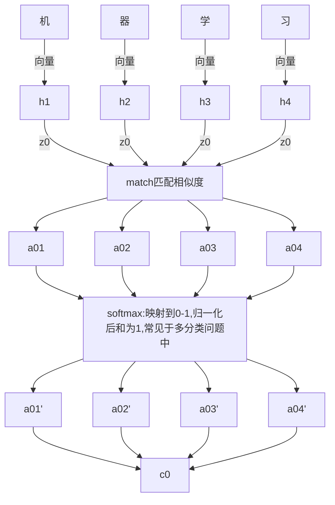
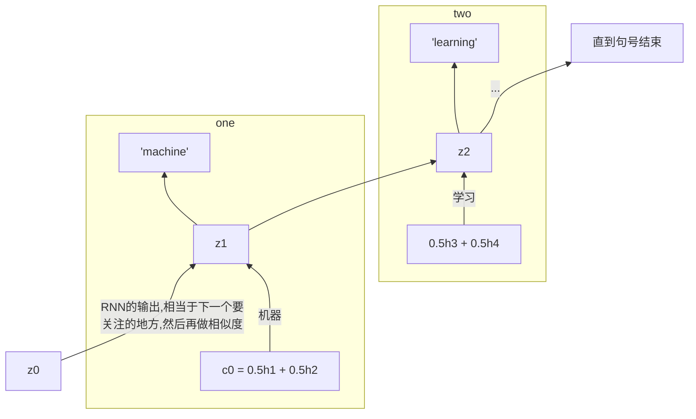
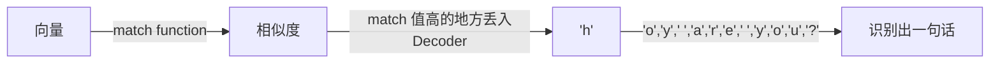
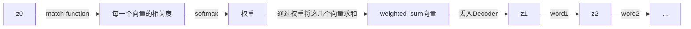

## Dynamic conditional generation

注意力机制

RNN

***

动态生成条件

对比：

* Past:  Encoder 的每个时间点的output都给Decoder, Decoder的input 是整个句子的信息
* Now: Decoder 看到的 information 在每个时间点都不一样

好处：

* Encoder 句子复杂的话，没有办法使用一个 vector 表示
* Decoder 可以值考虑需要的信息

## eg

### 机器翻译

每个时间点每个词汇都可以用一个向量来表示

其中 $z_{0}$ 先随机初始化，然后学习得到，也是向量

$c^{0} = \sum \hat{a}_{0}^{i}h^{i}$

比如，$\hat{\alpha}^{1}_{0} = 0.5, \hat{\alpha}^{2}_{0} = 0.5, \hat{\alpha}^{3}_{0} = 0.0, \hat{\alpha}^{4}_{0} = 0.0$，则 $c_{0} = \hat{\alpha}^{1}_{0}h^{1} + \hat{\alpha}^{1}_{0}h^{1}$，则$h^{1} , h^{2}$ 对应的词汇导入 decoder，即"机器"，输出"machine"

* Match，没有参数，导入$z_{0}$与$h^{1}$ ，返回相似度
* Match，有参数，通过学习得到的矩阵$W$ , $\alpha = h^{T}Wz$

*Decoder*

### 语音识别

输入：声音讯号，每个很小的时间间隔用向量表示

效果没有想过传统方法

### 图像字幕

将图片翻译为一段描述性的文字

一张图片用一组CNN中的filter描述图片，因为每一个filter的输出是一个向量

### 视频字幕

将视频分为图片帧