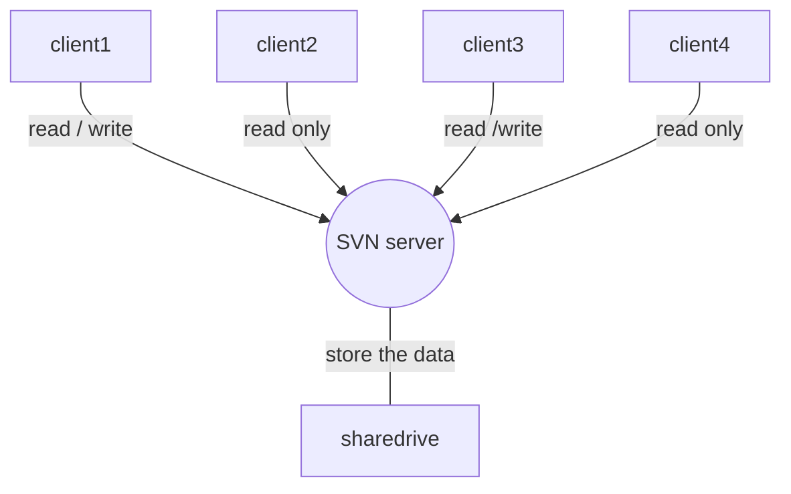

###  学习 markdown

> 引用块注释

*斜体*

**粗体**

~~删除线~~

文字间换行：在文字前输入

---

分割线

***

`文字底纹`

* 无序列表

+ 无序列表

- 无序列表

1. 有序列表


[内联超链接](http://www.zhengxiang4056.club)

[文章末尾][1]

---


[1]:https://www.zhengxiang4056.club


| 表格 | 表格 | 表格 |
| ---- | ---- | ---- |
|      |      |      |

>
>
>| :---- | ----: | :----: |
>| ----- | ----- | ------ |
>|       |       |        |
>
>:---代表左对齐，---:代表右对齐，:---:代表居中对齐，-数目至少一个，:没有默认左对齐


```c++
#include <iostream>
using namespace std;

int main(){
    cout << "hello world" << endl;
    return 0;
}

```


#include <iostream>

using namespace std;

int main(){	

​	cout << "hello world" << endl;

​	return 0;

}

---


[^1]

[^1]:文章末尾，脚注说明文字


转义字符 : \

标签：@(笔记)[标签A|标签B]

自动生成目录：[TOC] 或 [toc]

[TOC]

[TOC]


---


#### 复选框 ： - [ ] & - [x]  || + [x] & + [ ] || * [x] & * [ ] 

- [x] Markdown

- [ ] Javascript

+ [x] Markdown

+ [ ] Javascript

* [x] Markdown

* [ ] Javascript


---


#### 流程图  flow

```flow
st=>start: 开始
en=>end: 结束
op=>operation: 条件
cond=>condition: Yes or No?

st->op->cond
cond(yes)->en
cond(no)->op
```


#### 时序图  sequence

```sequence
Alice->Bob: Hello Bob, how are you?
Note right of Bob: Bob thinks
Bob-->Alice: I am good thanks!
```


#### 甘特图 gantt （貌似不支持）

```gantt
dataFormat YYYY-MM-DD
title Shop项目交付计划

section 里程碑 0.1
数据库设计		:active,	p1, 2016-08-15, 3d
详细设计		 :			 p2, after p1,   2d

section 里程碑 0.2
后端开发		 : 			 p3, 2016-08-22, 20d
前端开发		 :			 p4, 2016-18-22, 15d

section 里程碑 0.3
功能测试		 :			 p6, after p3, 	 5d
上线			  : 		  p7, after p6,   2d
交付			  :			  p8, after p7,   2d
```


---


#### 邮件写作

#### 文章快速排版

#### 印象笔记


---


#### Setext-style 标题 = - （貌似不支持）

This is an H1

==========

This is an H2

-----------------


#### 列表

* Bird
* Magic

```html
<ul>
    <li>Bird</li>
    <li>Magic</li>
</ul>
```


---


* Bird

* Magic

```html
<ul>
    <li><p>Bird</p></li>
    <li><p>Magic</p></li>
</ul>
```


---

#### 避免触发有序列表

1986. What a great season.

1986\. What a great season.

----

#### code blocks

Here is an example of AppleScript:

​	tell application "Foo"

​		beep

​	end tell

<p>Here is an example of AppleScript:
<pre><code>tell application "Foo"
    beep
end tell
</code></pre>
</p>
---


#### 内嵌图标

<i class="icon-weibo"></i>

<i class="icon-renren"></i>

---


#### LaTeX 公式

可以创建行内公式，例如 $\Gamma(n) = (n - 1)!\quad\forall n \ in \mathbb N$

块级公式：$$ x = \dfrac{-b\pm \sqrt{b^2 - 4ac}}{2a} $$

$ x^2 , x_1^2, x^{(n)}_{22}, ^{16}O^{2-}_{32},x^{y^{z^a}}, x^{y_z}$
$$
x^{2}	\\
x_{2}	\\
\partial f_{\mbox{\tiny 极大值}}	\\
\scriptstyle	\\
\frac{分子}{分母}	\\
\displaystyle\frac{x+y}{y+z}\\
\frac{\;1\;}{\;2\;}...\frac{;1;}{;2;}\\
\sqrt{根式表达式}\\
\sqrt[n]{hello}\\
\sqrt{a}+\sqrt{b}+\sqrt{c},\qquad \sqrt{\mathstrut a}+\sqrt{\mathstrut b} + \sqrt{\mathstrut c}\\
\sum_{k=1}^n, \sum\limits_{k=1}^n, \sum\nolimits_{k=1}^n\\
\int_a^b,\int\limits_0^\infty e^x,\int\nolimits_0^\infty e^x\\
\overline{上划线}\\
\underline{下划线}\\
\overline{\overline{a^2}+\underline{ab}+\bar{a}^3+\overline{a}^3}\\
\overbrace{公式}^{说明}\\
\underbrace{公式}_{说明}\\
\underbrace{a+\overbrace{b+\dots+b}^{m\mbox{\tiny 个}}}_{20\mbox{\scriptsize 个}}\\
\hat{a}, \check{a},\breve{a},\tilde{a},\bar{a},\vec{a},\acute{a},\grave{a},\mathring{a},\dot{a},\ddot{a}\\
\stacrel{上位符号}{基位符号},{上位公式\atop 下位公式},{上位公式\choose 下位公式}\\
() \big(\big) \Big(\Big) \bigg(\bigg) \Bigg(\Bigg) \big(\Big) \bigg(\Bigg)\\
(x)\left(x^{y^z}\right)\\
两个\qquad空格,一个\quad空格，大\ 空格,中等\;空格,小\,空格,没有空格,紧\!贴\\
\{ ... \}, \in, \not\in, A\subset B, A\subsetneqq B, A \not \subset B, A \cap B,A \cup B,\overline{A},A\setminus B,A\mathbb{R},\emptyset,
$$


***

#### 作图

##### 表格

这个 | 是半角符号

| 账户类型 | 免费账户 | 标准账户 | 高级账户  |
| -------- | -------- | -------- | --------- |
| 账户流量 | 60M      | 1GB      | 10GB      |
| 设备数目 | 2台      | 无限制   | 无限制    |
| 当前价格 | 免费     | ¥8.17/月 | ¥12.33/月 |

##### 图表

```chart
,预算,收入,花费,债务
June,5000,8000,4000,6000
July,3000,1000,4000,3000
Aug,5000,7000,6000,3000
Sep,7000,2000,3000,1000
Oct,6000,5000,4000,2000
Nov,4000,3000,5000,

type:pie
title:每月收益
x.title: Amount
y.title: Month
y.suffix: $
```


##### mermaid




